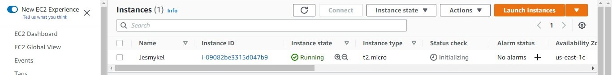
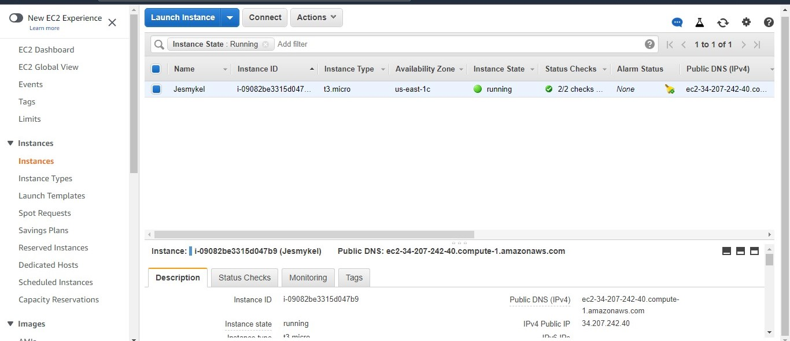

# Working with EC2 instance using the AWS CLI / Programmable access

Tasks:

1. Using your default vpc, find the public subnet
From management console, i located the default VPC, and identify the public subnet with the IGW attribute.

2. Create a security group
I created a security group from the SG icon on the VPC

3. Launch an instance with a web server with termination protection enabled
I launched an instance and enabled a termination protection under the advance setting and added a userdata to lauch a web server.

4. Monitor Your EC2 instance; view the types of metrics that are collected for an EC2 instance

5. Modify the security group that your web server is using to allow HTTP access
I modified the security group to allow HTTP access

 
6. Resize your Amazon EC2 instance to scale
To resize my EC2 instance; 

> I Selected the instance and choose Instance state, Stop instance. When prompted for confirmation, I chose Stop.
> With the instance still selected, I chose Actions, Instance settings, I changeed instance type from t2 micro to t3 micro. 
> On the Change instance type page, I did the following:
> For Instance type, I selected the instance type that I want.
> I chose Apply to accept the new settings.
> I selected the instance and choose Instance state, Start instance.

Guide
https://docs.aws.amazon.com/AWSEC2/latest/UserGuide/terminating-instances.html

https://docs.aws.amazon.com/AWSEC2/latest/UserGuide/ec2-instance-resize.html
